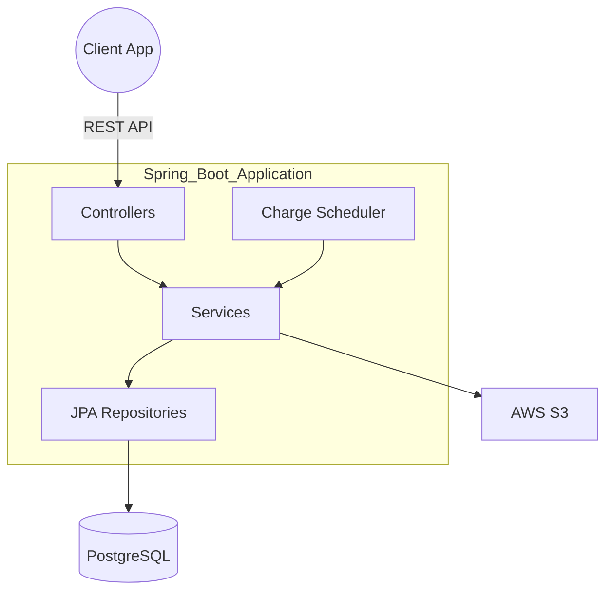

# Architecture & Design

Rent_Flow is built using a clean, layered architectural pattern with Spring Boot and Kotlin. This design ensures separation of concerns, testability, and scalability.

##  Layered Architecture

The application is structured into several distinct layers:

### 1. Presentation Layer (Controllers)
Located in `com.kotlin.rent_flow.controllers`, this layer handles HTTP requests and responses. It uses Spring Web's `@RestController` to expose RESTful endpoints.
- **Responsibilities**: Request validation, DTO mapping, and routing to the Service layer.

### 2. Service Layer
Located in `com.kotlin.rent_flow.services`, this layer contains the core business logic.
- **Interfaces**: Defined in `services/`, ensuring loose coupling.
- **Implementations**: Located in `services/impl/`.
- **Responsibilities**: Orchestrating domain entities, handling transactions, and implementing complex business rules (like charge generation).

### 3. Data Access Layer (Repositories)
Located in `com.kotlin.rent_flow.repositories`, this layer uses Spring Data JPA.
- **Responsibilities**: Abstracting database operations and providing a clean interface for CRUD and custom queries.

### 4. Domain Layer (Entities & Enums)
Located in `com.kotlin.rent_flow.entiites` and `com.kotlin.rent_flow.enums`.
- **Responsibilities**: Representing the persistent data state and core business objects.

##  Core Workflows

### Automated Charge Generation
The `ChargeScheduler` triggers the `ChargeGenerationService` daily. 
1. The service fetches all active `ChargeTemplates`.
2. It calculates if a new charge should be generated based on the `FrequencyType` and `startDate`.
3. It ensures idempotency by checking if a charge for the same template and period already exists.

### Receipt Management
The system is designed to integrate with **AWS S3** for storing payment receipts. 
- When a charge is marked as paid, an S3 key can be associated with the record.
- This keeps the database lightweight while allowing for document storage.

##  Design Patterns Used

- **Strategy Pattern**: Employed in the frequency calculation logic to handle different billing cycles (Monthly, Yearly, etc.).
- **Mapper Pattern**: Used to convert between Entities and DTOs, keeping the internal domain model separate from the external API contract.
- **Repository Pattern**: Decouples the service layer from the underlying database implementation.

##  System Diagram

