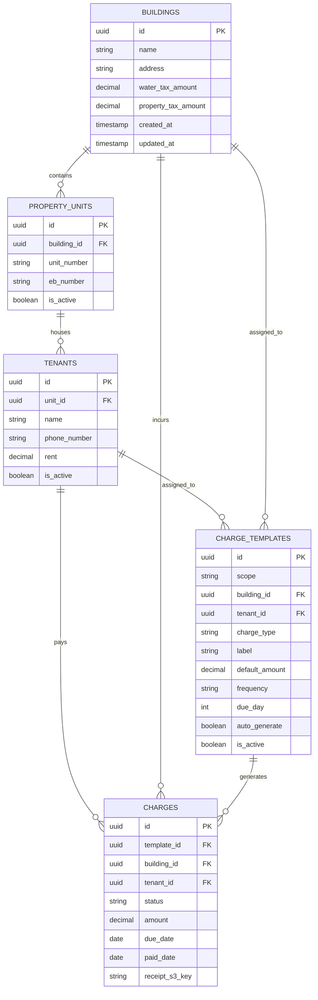

# Database Schema

Rent_Flow uses a PostgreSQL database to store persistent records. The schema is managed by Hibernate with automatic updates.

##  Entity Relationship Diagram

##  Table Definitions

### `buildings`
Primary entity representing a physical property.
- `id`: UUID, Primary Key.
- `name`: String, name of the building.
- `water_tax_amount`: Yearly water tax estimate.

### `property_units`
Specific units (apartments/offices) within a building.
- `building_id`: Foreign Key to `buildings`.
- `unit_number`: String, unique within building.

### `tenants`
The occupants of a property unit.
- `unit_id`: Foreign Key to `property_units`.
- `rent`: The base monthly rent for this tenant.

### `charge_templates`
Configuration for automated billing.
- `frequency`: Enum (MONTHLY, YEARLY, etc.).
- `scope`: Enum (TENANT or BUILDING).

### `charges`
Individual billing records.
- `status`: Enum (PENDING, PAID, DRAFT).
- `period_month`/`period_year`: Used to track billing periods.
